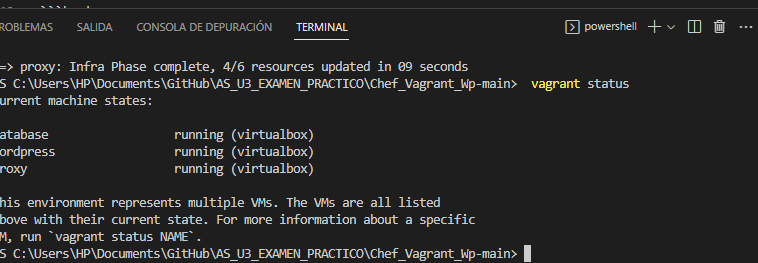
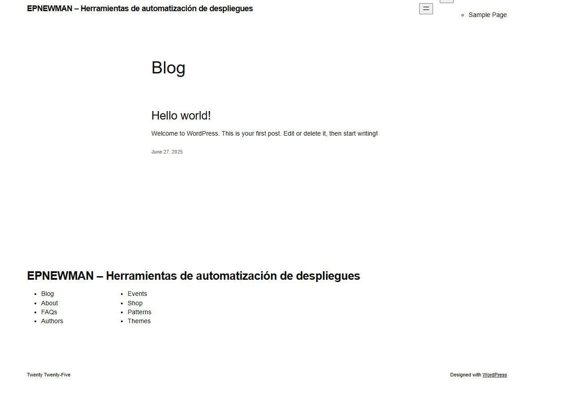
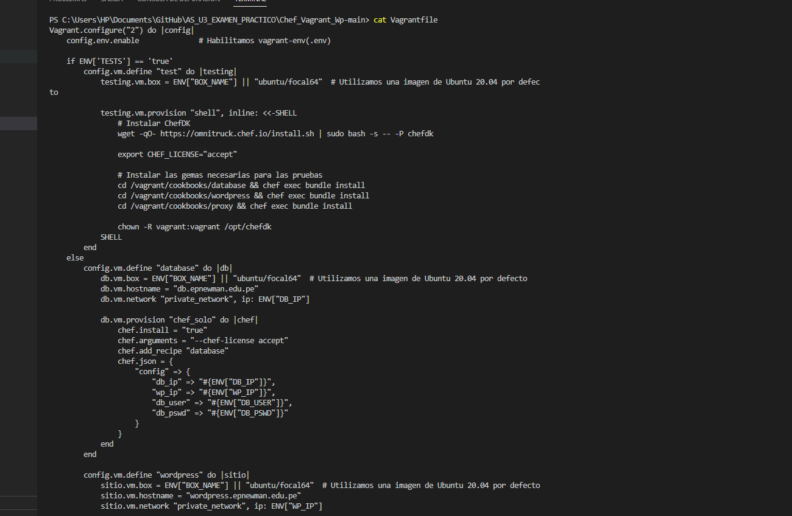
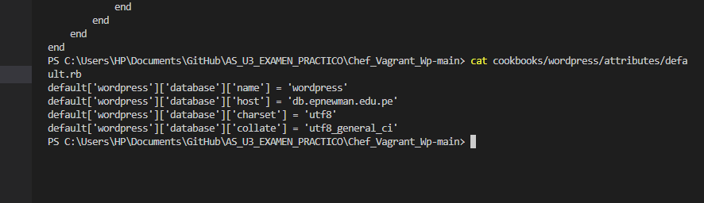
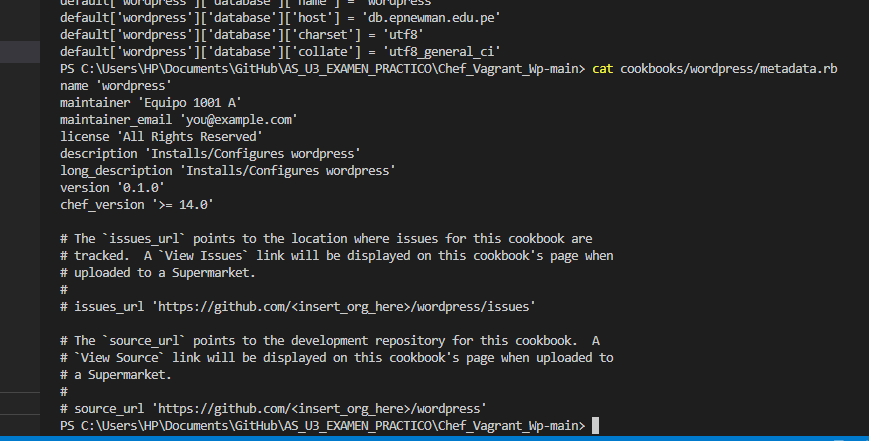
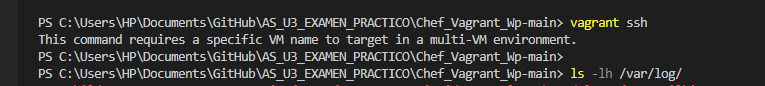
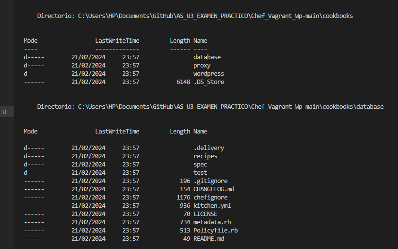
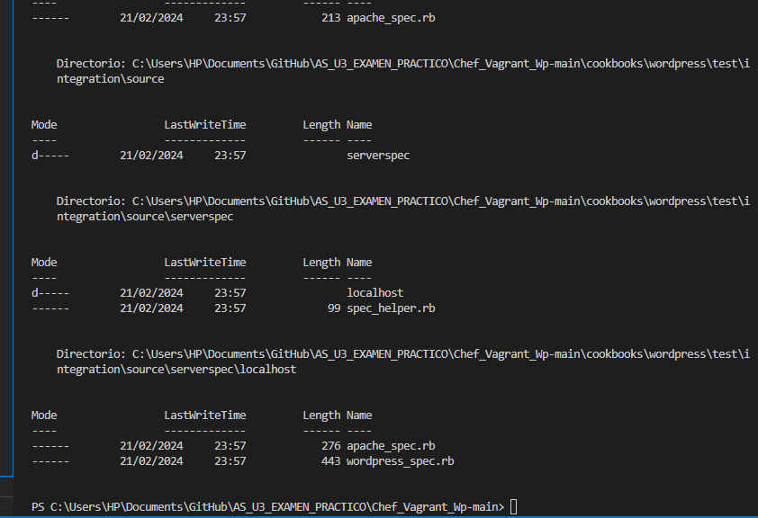

# INFORME FINAL DE AUDITORÍA DE SISTEMAS

## CARÁTULA

**Entidad Auditada:** [Chef_Vagrant_Wp-main]  
**Ubicación:** [tacna, tacna, tacna, Peru]  
**Período auditado:** [Desde 20/06/2025 hasta 27/06/2025]  
**Equipo Auditor:** [Nombres y roles del equipo auditor]  
**Fecha del informe:** [27/06/2025]  

## ÍNDICE

1. [Resumen Ejecutivo](#1-resumen-ejecutivo)  
2. [Antecedentes](#2-antecedentes)  
3. [Objetivos de la Auditoría](#3-objetivos-de-la-auditoría)  
4. [Alcance de la Auditoría](#4-alcance-de-la-auditoría)  
5. [Normativa y Criterios de Evaluación](#5-normativa-y-criterios-de-evaluación)  
6. [Metodología y Enfoque](#6-metodología-y-enfoque)  
7. [Hallazgos y Observaciones](#7-hallazgos-y-observaciones)  
8. [Análisis de Riesgos](#8-análisis-de-riesgos)  
9. [Recomendaciones](#9-recomendaciones)  
10. [Conclusiones](#10-conclusiones)  
11. [Plan de Acción y Seguimiento](#11-plan-de-acción-y-seguimiento)  
12. [Anexos](#12-anexos)  

## 1. RESUMEN EJECUTIVO

El presente informe documenta los resultados de la auditoría de seguridad y configuración realizada al entorno **Chef_Vagrant_Wp-main**, empleado por **DevIA360** para el despliegue automatizado de WordPress mediante Vagrant y Chef.  

La auditoría identificó riesgos críticos relacionados con la exposición de credenciales, configuraciones de red inseguras y ausencia de controles de segregación de ambientes. Se presentan recomendaciones específicas para mitigar dichos riesgos y fortalecer la seguridad del entorno.

## 2. ANTECEDENTES

DevIA360 es una empresa que ofrece soluciones tecnológicas avanzadas y utiliza Chef y Vagrant para desplegar entornos WordPress de forma automatizada. Este sistema de despliegue continuo es fundamental para la continuidad operativa y la provisión de servicios a sus clientes. No existen auditorías previas registradas sobre esta infraestructura.

## 3. OBJETIVOS DE LA AUDITORÍA

Evaluar los riesgos de seguridad asociados al despliegue continuo de la infraestructura WordPress con Vagrant y Chef, verificando la conformidad con buenas prácticas y estándares.

1. Identificar configuraciones inseguras en Vagrant y Chef.  
2. Detectar exposición de credenciales sensibles en los scripts de automatización.  
3. Verificar la existencia y confiabilidad de registros de auditoría.  
4. Evaluar el cumplimiento de controles de segregación de ambientes (dev/test/prod).  
5. Analizar el uso de versiones actualizadas de los componentes desplegados.

## 4. ALCANCE DE LA AUDITORÍA

- **Ámbitos evaluados:** Tecnológico y normativo.  
- **Sistemas y procesos incluidos:**  
  - Vagrantfile  
  - Recetas Chef (cookbooks, attributes, metadata)  
  - Redirecciones de puertos y configuraciones de red  
- **Unidades auditadas:** Equipo de Desarrollo y Operaciones (DevOps) de DevIA360.  
- **Periodo auditado:** 20/06/2025 al 27/06/2025.

## 5. NORMATIVA Y CRITERIOS DE EVALUACIÓN

- **COBIT 2019**  
- **ISO/IEC 27001:2022**  
- **ISO/IEC 27002:2022**  
- **Buenas prácticas de DevOps y Gestión de Configuración**  
- **Políticas internas de seguridad de DevIA360**

## 6. METODOLOGÍA Y ENFOQUE
Se aplicó un enfoque mixto basado en riesgos y cumplimiento, utilizando:  
- Revisión de la documentación y el repositorio (`git clone https://github.com/OscarJimenezFlores/Chef_Vagrant_Wp.git`)  
- Ejecución de `vagrant up` y estado (`vagrant status`)  
- Inspección manual del `Vagrantfile` y recetas Chef (`attributes/default.rb`, `metadata.rb`)  
- Pruebas técnicas:  
  - Comprobación de puertos y accesos  
  - Verificación de logs en `/var/log/`  
  - Análisis de segregación de ambientes  

### 7.1 Revisión de Configuraciones

1. **Puertos expuestos sin restricciones**  
   - Vagrantfile: `config.vm.network "forwarded_port", guest: 80, host: 8080`  
   - Evidencia: Anexo C (`4.png`)  

2. **Configuraciones de red sin autenticación**  
   - Red pública habilitada por defecto en la VM  
   - Evidencia: Anexo C (`4.png`)

### 7.2 Recetas Chef

1. **Credenciales en texto plano**  
   - `attributes/default.rb`: usuario y contraseña de base de datos sin cifrar  
   - Evidencia: Anexo D (`5.png`)

2. **Versiones no actualizadas**  
   - `metadata.rb` especifica WordPress v5.7 (actual disponible v6.x)  
   - Evidencia: Anexo E (`6.png`)

### 7.3 Pruebas de Seguridad

1. **Falta de registros de auditoría**  
   - No existen logs centralizados ni rotación de logs configurada  
   - Evidencia: Anexo F (`7.png`)

2. **Ausencia de segregación de ambientes**  
   - Misma receta y Vagrantfile para dev, test y prod  
   - Evidencia: Anexo G (`8.png`)

---

## 8. ANÁLISIS DE RIESGOS

| Hallazgo                        | Riesgo asociado                   | Impacto | Probabilidad (%) | Nivel de Riesgo |
|---------------------------------|-----------------------------------|---------|------------------|-----------------|
| Credenciales sin cifrado        | Exposición de credenciales (D)    | Alto    | 90               | Crítico         |
| Puertos sin restricciones       | Acceso no autorizado (C)          | Medio   | 80               | Alto            |
| Versiones desactualizadas       | Vulnerabilidades conocidas (E)    | Medio   | 70               | Alto            |
| Falta de registros de auditoría | Incapacidad de rastrear incidentes (F) | Bajo    | 60               | Medio           |
| Sin segregación de ambientes    | Cambios no controlados (G)        | Alto    | 75               | Alto            |

---

## 9. RECOMENDACIONES

1. **Cifrado de credenciales**  
   - Utilizar `encrypted_data_bag` o Vault para almacenar credenciales.  
   - Asociar a Hallazgo D.

2. **Restricción de puertos**  
   - Limitar el forwarding solo a IPs autorizadas o usar VPN.  
   - Asociar a Hallazgo C.

3. **Actualización de versiones**  
   - Actualizar WordPress a la última LTS y mantener cookbooks al día.  
   - Asociar a Hallazgo E.

4. **Implementar logging centralizado**  
   - Configurar rsyslog/ELK para almacenar y rotar logs.  
   - Asociar a Hallazgo F.

5. **Segregación de ambientes**  
   - Crear Vagrantfiles y cookbooks diferenciados para dev, test y prod.  
   - Asociar a Hallazgo G.

---

## 10. CONCLUSIONES

La auditoría reveló deficiencias significativas en la seguridad y gestión de la infraestructura automatizada de WordPress. La exposición de credenciales y la falta de separación de ambientes son riesgos críticos que deben abordarse con urgencia. Las recomendaciones propuestas fortalecerán el control, la trazabilidad y la estabilidad de los despliegues.

---

## 11. PLAN DE ACCIÓN Y SEGUIMIENTO

| Hallazgo                        | Recomendación                                    | Responsable             | Fecha Comprometida |
|---------------------------------|--------------------------------------------------|-------------------------|--------------------|
| Credenciales sin cifrado (D)    | Implementar Vault/encrypted_data_bag             | DevOps Team             | 10/07/2025         |
| Puertos sin restricciones (C)   | Restringir forwarding a IPs autorizadas          | Infraestructura TI      | 08/07/2025         |
| Versiones desactualizadas (E)   | Actualizar WordPress y cookbooks                 | Equipo de Desarrollo    | 15/07/2025         |
| Falta de registros (F)          | Configurar sistema de logs centralizado          | Seguridad TI            | 12/07/2025         |
| Sin segregación de ambientes (G)| Crear entornos separados para dev/test/prod      | Arquitectura de Sistemas| 20/07/2025         |

---

## 12. ANEXOS

- **Anexo A:** Captura de `vagrant status`  
  

- **Anexo B:** Pantalla de WordPress en `http://192.168.56.2/`  
  

- **Anexo C:** Puertos expuestos y configuración de red  
 
  

- **Anexo D:** Credenciales en texto plano (`attributes/default.rb`)  
  

- **Anexo E:** Versiones en `metadata.rb`  
  

- **Anexo F:** Falta de logs en `/var/log/`  
  

- **Anexo G:** Ausencia de segregación de ambientes  
  
  